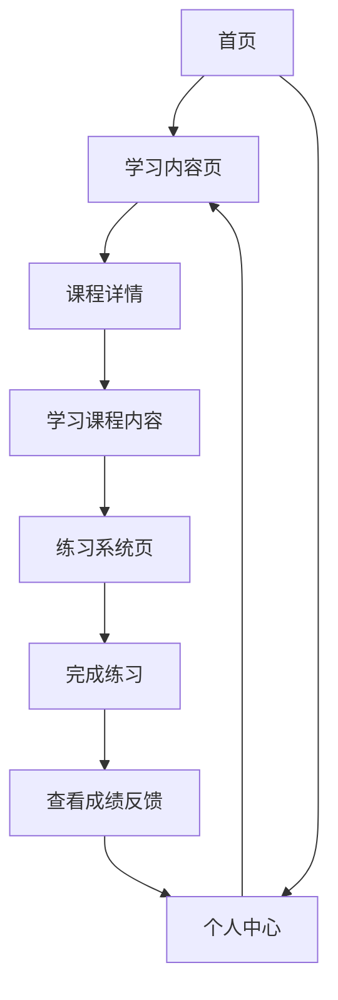

## 1. Product Overview
数据分析技术学习网站是一个专注于数据分析技能培养的在线学习平台，提供系统化的学习内容和交互式练习。
- 主要目的是帮助用户掌握数据分析的核心技能，解决实际工作中的数据处理和分析问题
- 目标用户为数据分析师、数据科学家、商务分析师以及希望提升数据技能的职场人士

## 2. Core Features

### 2.1 User Roles
| Role | Registration Method | Core Permissions |
|------|---------------------|------------------|
| 普通用户 | 邮箱注册 | 浏览学习内容、完成练习、查看个人学习进度 |
| 高级用户 | 付费升级 | 访问高级内容、下载学习资料、获得学习证书 |

### 2.2 Feature Module
1. **首页**：导航栏、学习路径、推荐课程、最新动态
2. **学习内容页**：课程列表、课程详情、学习进度
3. **练习系统页**：练习题列表、答题界面、成绩反馈
4. **个人中心**：学习统计、证书管理、个人设置

### 2.3 Page Details
| Page Name | Module Name | Feature description |
|-----------|-------------|---------------------|
| 首页 | 导航栏 | 提供网站主要功能入口，包括学习内容、练习系统、个人中心等 |
| 首页 | 学习路径 | 展示数据分析学习的推荐路径，引导用户系统性学习 |
| 首页 | 推荐课程 | 根据用户学习历史和热门程度推荐相关课程 |
| 学习内容页 | 课程列表 | 展示10项核心数据分析学习内容，包括数据基础、统计分析、可视化等 |
| 学习内容页 | 课程详情 | 提供课程的详细介绍、章节内容、学习资源等 |
| 学习内容页 | 学习进度 | 跟踪用户的学习进度，显示已完成和未完成的内容 |
| 练习系统页 | 练习题列表 | 根据学习内容提供对应的练习题，按难度分级 |
| 练习系统页 | 答题界面 | 提供交互式答题体验，支持多种题型（选择题、填空题、编程题等） |
| 练习系统页 | 成绩反馈 | 答题完成后提供详细的成绩分析和解析 |
| 个人中心 | 学习统计 | 展示用户的学习数据，包括学习时长、完成课程数、练习成绩等 |
| 个人中心 | 证书管理 | 管理用户获得的学习证书，支持证书查看和下载 |
| 个人中心 | 个人设置 | 允许用户修改个人信息、密码等 |

## 3. Core Process
用户注册登录后，可以浏览学习内容，选择感兴趣的课程进行学习。学习完成后，可以进入练习系统进行相关练习，巩固所学知识。系统会记录用户的学习进度和练习成绩，并在个人中心展示相关统计数据。

## 4. User Interface Design
### 4.1 Design Style
- 主色调：深蓝色 (#1a365d) 和浅蓝色 (#4299e1)
- 辅助色：绿色 (#38a169) 用于成功状态，红色 (#e53e3e) 用于错误状态
- 按钮风格：圆角矩形，有轻微的阴影效果
- 字体：使用无衬线字体，标题使用较大字号，正文使用适中字号
- 布局风格：卡片式布局，清晰的信息层次，充足的留白
- 图标风格：使用简约现代的线性图标

### 4.2 Page Design Overview
| Page Name | Module Name | UI Elements |
|-----------|-------------|-------------|
| 首页 | 导航栏 | 固定顶部，包含网站logo、主要导航链接和用户登录/注册按钮 |
| 首页 | 学习路径 | 时间轴形式展示，每个节点代表一个学习阶段，配有图标和简短描述 |
| 首页 | 推荐课程 | 卡片式布局，每张卡片包含课程名称、简介、难度和评分 |
| 学习内容页 | 课程列表 | 网格布局，每个课程项包含课程名称、图标、难度和学习人数 |
| 学习内容页 | 课程详情 | 左侧为课程目录，右侧为课程内容，支持代码高亮和图表展示 |
| 练习系统页 | 答题界面 | 顶部为题目信息，中间为答题区域，底部为提交按钮和倒计时 |
| 个人中心 | 学习统计 | 使用图表展示学习数据，包括学习时长趋势、课程完成情况等 |

### 4.3 Responsiveness
- 采用桌面优先设计，同时支持平板和移动设备
- 在小屏幕设备上，导航栏变为汉堡菜单，内容布局调整为单列
- 确保所有交互元素在触摸设备上有足够的点击区域

### 4.4 3D Scene Guidance
- 不适用，本项目主要为2D界面