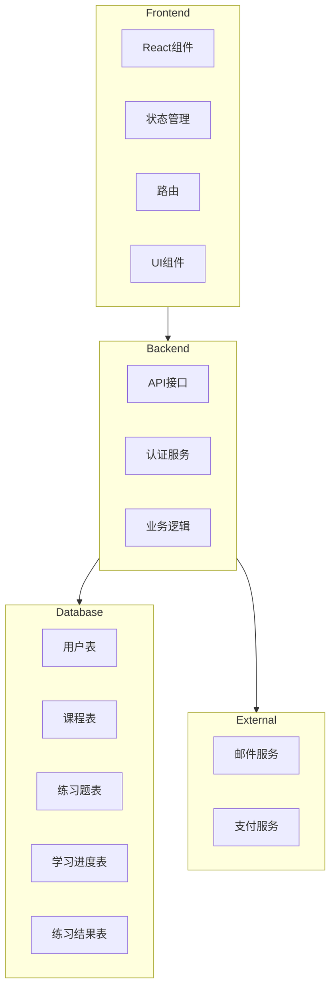
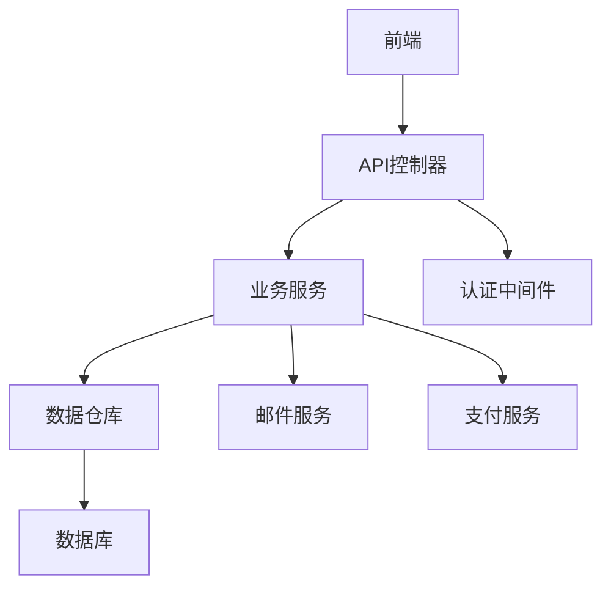
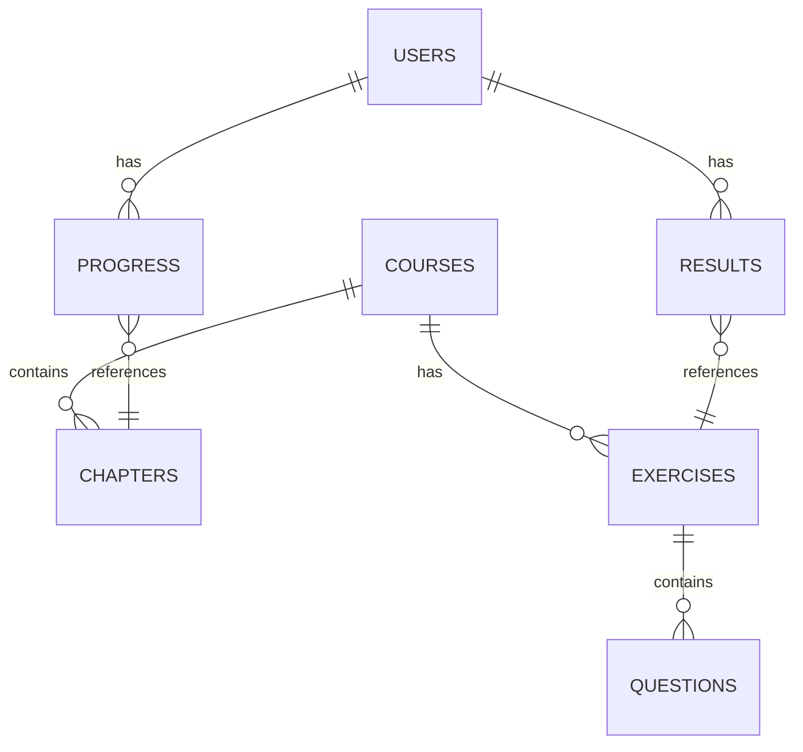

## 1. Architecture Design


## 2. Technology Description
- Frontend: React@18 + TypeScript + Tailwind CSS + Vite
- Initialization Tool: vite-init
- Backend: Express.js + TypeScript
- Database: PostgreSQL
- Authentication: JWT
- State Management: Zustand
- Routing: React Router
- UI Components: Custom components + Lucide icons
- Charting: Chart.js

## 3. Route Definitions
| Route | Purpose |
|-------|---------|
| / | 首页 |
| /courses | 课程列表页 |
| /courses/:id | 课程详情页 |
| /exercises | 练习题列表页 |
| /exercises/:id | 答题界面 |
| /profile | 个人中心 |
| /profile/statistics | 学习统计 |
| /profile/certificates | 证书管理 |
| /profile/settings | 个人设置 |
| /login | 登录页 |
| /register | 注册页 |

## 4. API Definitions

### 4.1 用户相关
- **POST /api/auth/register** - 用户注册
  - Request: { email, password, name }
  - Response: { id, email, name, token }

- **POST /api/auth/login** - 用户登录
  - Request: { email, password }
  - Response: { id, email, name, token }

- **GET /api/auth/profile** - 获取用户信息
  - Response: { id, email, name, role, createdAt }

### 4.2 课程相关
- **GET /api/courses** - 获取课程列表
  - Response: [{ id, title, description, level, category, image, enrolledCount }]

- **GET /api/courses/:id** - 获取课程详情
  - Response: { id, title, description, level, category, image, chapters: [{ id, title, content }] }

- **POST /api/courses/:id/progress** - 更新学习进度
  - Request: { chapterId, completed }
  - Response: { success: true }

### 4.3 练习相关
- **GET /api/exercises** - 获取练习题列表
  - Query: courseId, difficulty
  - Response: [{ id, title, description, difficulty, courseId }]

- **GET /api/exercises/:id** - 获取练习题详情
  - Response: { id, title, description, difficulty, courseId, questions: [{ id, type, content, options, answer }] }

- **POST /api/exercises/:id/submit** - 提交练习答案
  - Request: { answers: [{ questionId, answer }] }
  - Response: { score, correctCount, totalCount, feedback: [{ questionId, correct, explanation }] }

### 4.4 统计相关
- **GET /api/statistics** - 获取学习统计数据
  - Response: { totalCourses, completedCourses, totalExercises, completedExercises, totalTimeSpent, averageScore }

## 5. Server Architecture Diagram


## 6. Data Model

### 6.1 Data Model Definition


### 6.2 Data Definition Language

#### 用户表 (users)
```sql
CREATE TABLE users (
    id SERIAL PRIMARY KEY,
    email VARCHAR(255) UNIQUE NOT NULL,
    password_hash VARCHAR(255) NOT NULL,
    name VARCHAR(100) NOT NULL,
    role VARCHAR(20) DEFAULT 'user', -- user or premium
    created_at TIMESTAMP DEFAULT CURRENT_TIMESTAMP,
    updated_at TIMESTAMP DEFAULT CURRENT_TIMESTAMP
);
```

#### 课程表 (courses)
```sql
CREATE TABLE courses (
    id SERIAL PRIMARY KEY,
    title VARCHAR(255) NOT NULL,
    description TEXT NOT NULL,
    level VARCHAR(20) NOT NULL, -- beginner, intermediate, advanced
    category VARCHAR(50) NOT NULL,
    image VARCHAR(255),
    enrolled_count INTEGER DEFAULT 0,
    created_at TIMESTAMP DEFAULT CURRENT_TIMESTAMP,
    updated_at TIMESTAMP DEFAULT CURRENT_TIMESTAMP
);
```

#### 章节表 (chapters)
```sql
CREATE TABLE chapters (
    id SERIAL PRIMARY KEY,
    course_id INTEGER REFERENCES courses(id),
    title VARCHAR(255) NOT NULL,
    content TEXT NOT NULL,
    order_index INTEGER NOT NULL,
    created_at TIMESTAMP DEFAULT CURRENT_TIMESTAMP,
    updated_at TIMESTAMP DEFAULT CURRENT_TIMESTAMP
);
```

#### 练习题表 (exercises)
```sql
CREATE TABLE exercises (
    id SERIAL PRIMARY KEY,
    course_id INTEGER REFERENCES courses(id),
    title VARCHAR(255) NOT NULL,
    description TEXT NOT NULL,
    difficulty VARCHAR(20) NOT NULL, -- easy, medium, hard
    created_at TIMESTAMP DEFAULT CURRENT_TIMESTAMP,
    updated_at TIMESTAMP DEFAULT CURRENT_TIMESTAMP
);
```

#### 问题表 (questions)
```sql
CREATE TABLE questions (
    id SERIAL PRIMARY KEY,
    exercise_id INTEGER REFERENCES exercises(id),
    type VARCHAR(20) NOT NULL, -- multiple_choice, fill_blank, coding
    content TEXT NOT NULL,
    options JSONB, -- for multiple choice
    answer JSONB NOT NULL,
    explanation TEXT,
    order_index INTEGER NOT NULL,
    created_at TIMESTAMP DEFAULT CURRENT_TIMESTAMP,
    updated_at TIMESTAMP DEFAULT CURRENT_TIMESTAMP
);
```

#### 学习进度表 (progress)
```sql
CREATE TABLE progress (
    id SERIAL PRIMARY KEY,
    user_id INTEGER REFERENCES users(id),
    chapter_id INTEGER REFERENCES chapters(id),
    completed BOOLEAN DEFAULT false,
    completed_at TIMESTAMP,
    created_at TIMESTAMP DEFAULT CURRENT_TIMESTAMP,
    updated_at TIMESTAMP DEFAULT CURRENT_TIMESTAMP,
    UNIQUE(user_id, chapter_id)
);
```

#### 练习结果表 (results)
```sql
CREATE TABLE results (
    id SERIAL PRIMARY KEY,
    user_id INTEGER REFERENCES users(id),
    exercise_id INTEGER REFERENCES exercises(id),
    score INTEGER NOT NULL,
    correct_count INTEGER NOT NULL,
    total_count INTEGER NOT NULL,
    completed_at TIMESTAMP DEFAULT CURRENT_TIMESTAMP,
    created_at TIMESTAMP DEFAULT CURRENT_TIMESTAMP
);
```

### 6.3 初始数据

#### 课程数据
```sql
INSERT INTO courses (title, description, level, category, image) VALUES
('数据基础与SQL', '掌握数据存储和查询的基础知识，包括数据库原理和SQL语句', 'beginner', '数据基础', 'https://trae-api-cn.mchost.guru/api/ide/v1/text_to_image?prompt=data%20basics%20and%20SQL%20database%20concepts&image_size=square'),
('统计分析基础', '学习描述性统计和推断性统计的核心概念和方法', 'beginner', '统计分析', 'https://trae-api-cn.mchost.guru/api/ide/v1/text_to_image?prompt=statistics%20analysis%20concepts%20and%20charts&image_size=square'),
('数据可视化', '掌握数据可视化的原理和工具，创建有效的数据图表', 'intermediate', '数据可视化', 'https://trae-api-cn.mchost.guru/api/ide/v1/text_to_image?prompt=data%20visualization%20charts%20and%20graphs&image_size=square'),
('Python数据分析', '使用Python进行数据处理、分析和建模', 'intermediate', '编程语言', 'https://trae-api-cn.mchost.guru/api/ide/v1/text_to_image?prompt=Python%20data%20analysis%20with%20pandas%20and%20numpy&image_size=square'),
('机器学习基础', '了解机器学习的基本概念和常用算法', 'intermediate', '机器学习', 'https://trae-api-cn.mchost.guru/api/ide/v1/text_to_image?prompt=machine%20learning%20basics%20and%20algorithms&image_size=square'),
('深度学习入门', '学习深度学习的基本原理和常用模型', 'advanced', '机器学习', 'https://trae-api-cn.mchost.guru/api/ide/v1/text_to_image?prompt=deep%20learning%20neural%20networks%20concepts&image_size=square'),
('大数据处理', '掌握大数据处理的技术和工具，如Hadoop和Spark', 'advanced', '大数据', 'https://trae-api-cn.mchost.guru/api/ide/v1/text_to_image?prompt=big%20data%20processing%20with%20hadoop%20and%20spark&image_size=square'),
('时间序列分析', '学习时间序列数据的分析方法和预测模型', 'intermediate', '统计分析', 'https://trae-api-cn.mchost.guru/api/ide/v1/text_to_image?prompt=time%20series%20analysis%20and%20forecasting&image_size=square'),
('文本分析', '掌握文本数据的处理和分析方法', 'intermediate', '数据分析', 'https://trae-api-cn.mchost.guru/api/ide/v1/text_to_image?prompt=text%20analysis%20and%20natural%20language%20processing&image_size=square'),
('数据工程基础', '了解数据工程的核心概念和实践', 'advanced', '数据工程', 'https://trae-api-cn.mchost.guru/api/ide/v1/text_to_image?prompt=data%20engineering%20pipelines%20and%20ETL&image_size=square');
```

#### 章节数据 (示例)
```sql
-- 为数据基础与SQL课程添加章节
INSERT INTO chapters (course_id, title, content, order_index) VALUES
(1, '数据库基础', '数据库的基本概念、类型和结构...', 1),
(1, 'SQL基础', 'SQL语句的基本语法和使用方法...', 2),
(1, 'SQL查询进阶', '复杂查询、连接和子查询...', 3),
(1, '数据建模', '实体关系模型和数据库设计...', 4);

-- 为统计分析基础课程添加章节
INSERT INTO chapters (course_id, title, content, order_index) VALUES
(2, '描述性统计', '均值、中位数、方差等描述性统计指标...', 1),
(2, '概率基础', '概率分布和随机变量...', 2),
(2, '假设检验', 't检验、卡方检验等假设检验方法...', 3),
(2, '回归分析', '线性回归和相关分析...', 4);
```

#### 练习题数据 (示例)
```sql
-- 为数据基础与SQL课程添加练习题
INSERT INTO exercises (course_id, title, description, difficulty) VALUES
(1, 'SQL基础练习', '测试SQL基本语句的使用能力', 'easy'),
(1, 'SQL查询进阶练习', '测试复杂SQL查询的能力', 'medium'),
(1, '数据库设计练习', '测试数据库设计和建模能力', 'hard');

-- 为统计分析基础课程添加练习题
INSERT INTO exercises (course_id, title, description, difficulty) VALUES
(2, '描述性统计练习', '测试描述性统计指标的计算和理解', 'easy'),
(2, '概率基础练习', '测试概率分布和随机变量的理解', 'medium'),
(2, '假设检验练习', '测试假设检验方法的应用', 'hard');
```

#### 问题数据 (示例)
```sql
-- 为SQL基础练习添加问题
INSERT INTO questions (exercise_id, type, content, options, answer, explanation, order_index) VALUES
(1, 'multiple_choice', '以下哪个SQL语句用于从表中选择所有数据？', 
 '[
   "SELECT * FROM table;",
   "SELECT ALL FROM table;",
   "SELECT EVERYTHING FROM table;",
   "SELECT FROM table;"
 ]', 
 '"SELECT * FROM table;"', 
 'SELECT * 语句用于选择表中的所有列和所有行。', 1),
(1, 'fill_blank', 'SQL中用于插入数据的语句是__________。', 
 null, 
 '"INSERT"', 
 'INSERT语句用于向表中插入新数据。', 2);
```